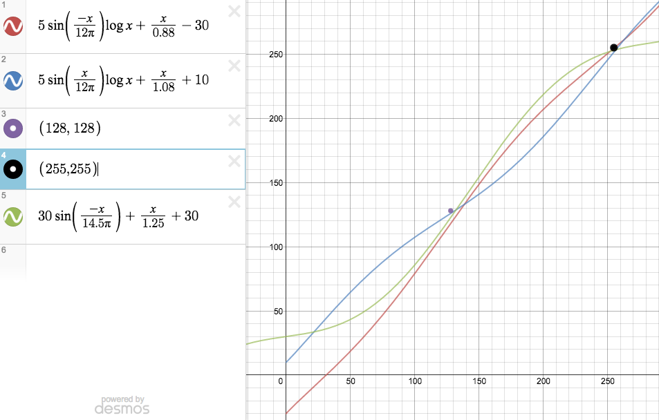

# Special Project HW1

Though we only need to choose one of question 2 or 3 to work on, I do really want to practice, so I've done both question 2 and 3.

## Specification

**1. Simple Filter**:
Change the color tone to let the picture looks 文青. 
**2. Vignette and Light Source**: Add shadowy corner which can bright the center and a light source if desired. 
**3. Movie Filter**: Make normal photographed picture looks like picture from a movie.

## Concept Development

1. **Simple Filter**

	According to spec, we know that it's simply a reversed version of practice in first meeting. Thus, iterate through the whole picture and give RGB three color new proportion might be what we need to do here.

2. **Vignette and Light Source**

	This is little more complicated but similar in concept regarded to former question. Vignette and light source require same work but inverse direction of painting color on. We might need to calculate the normalized distance between processing pixel and source, and gradually give black/white(for vignette/light) according to that nomalized distance.

3. **Movie Filter**

	According to [this tutorial](http://photoblog.hk/wordpress/105136/如何在-ps-以曲線-curves-拉出電影感色調), if we can generate the function for modifying RGB proportion like stated, it's quite easy to fulfill this part.

## Implementation

1. **Simple Filter**

	For convenience, I add track-bar on display window to control how much of RGB should incre/decre from original image. Since only integer can be set as track bar count, I made it range from 0 to 200 and initially 100. When any track bar is changed(called back), normalize the data of them and iteratly multipy on pixels of a newly cloned image. This made me find my favorite 文青 filter easily to be R:G:B = 1.3R:1.1G:0.9B.
	

2. **Vignette and Light Source**

	I take light source for explanation below.
	
	First of all, I determine the size of light to fixed `int light_halfsize` according to width and length of the image.

		light_halfsize = result.cols < result.rows ? result.cols/4 : result.rows/4;

	And then, create `function dist(...)` to calculate distance between two points. Using it in `function light_dist(...)` can then get normalized distance range from 1 to infinity. While we only iterate limitless `2*light_halfsize` pixels in both column and row, and we gave specialized arguments which make the light dimmer when getting away from source as well, the actual range of return value of `function light_dist(...)` is approximately from 0 to 1. 

		float dist(int x, int y, int x_ori, int y_ori) {
			return sqrt(pow(x-x_ori, 2) + pow(y-y_ori, 2));
		}

		float light_dist(int x, int y, int x_ori, int y_ori) {
			float norm_dist = dist(x, y, x_ori, y_ori)/light_halfsize/0.8;
			return pow(20, 0-norm_dist);
		}
		
	Use above return value as a scale and combine original image color with designed orange(composed of (MAX_RED, MAX_GREEN, MAXBLUE)) in proportion to (1-scale):scale. Then we can get a cute light on the picture:))
	
		const int MAX_BLUE = 200;
		const int MAX_GREEN = 230;
		const int MAX_RED = 255;
		
		...
	
		float scale = light_dist(j, i, x, y);
		pixptr[0] = pixptr[0]*(1-scale) + MAX_BLUE * scale;
		pixptr[1] = pixptr[1]*(1-scale) + MAX_GREEN * scale;
		pixptr[2] = pixptr[2]*(1-scale) + MAX_RED * scale;
		pixptr += 3;

3. **Movie Filter**

	As mentioned in *Concept Development*, we can actually process the steps in the tutorial page by finding according functions to all those steps. And I fulfilled it by using [Desmos](https://www.desmos.com/calculator) to gradually get all those arguments which satisfy the curves in PS the most.
	
	
	
	Implement functions generated and apply to `pixptr` can then get nice filtered image which looks quite like a shot from movie!
	
		uchar contrast(uchar input) {
			float tmp = 30.0*sin((0-input)/14.5/M_PI) + input/1.25 + 30;
			if(tmp > 255) return 255;
			else return tmp;
		}
		uchar colorR(uchar input) {
			float tmp = 5.0*sin((0-input)/12/M_PI)*log10(input) + input/0.88 - 30;
			if(tmp > 255) return 255;
			else if(tmp < 0) return 0;
			else return tmp;
		}
		uchar color(uchar input) {
			float tmp = 5.0*sin((input)/12/M_PI)*log10(input) + input/1.08 + 10;
			if(tmp > 255) return 255;
			else return tmp;
		}
	
	We can also cut the image into ratio of 16:9 by calculating with code below, which make it much much more like movie!

		edge_size = (image.rows-image.cols/16*9)/2;

		...

		// Black Edge
		if(i < edge_size || i > image.rows-edge_size)
			pixptr[0] = pixptr[1] = pixptr[2] = 0;

## Discussion

1. **Simple Filter**

	At the beginning, I didn't use the track bars to control my filter, but it was really inconvenient. I have to rerun each time failed to get the desired colors. Thus, it came up to me that using track bars might be much easier and more intuitive for user!

2. **Vignette and Light Source**

	This question actually cost me most of the time. I was stuck in some mathematic probelms of calculating exact normalized distance. After solving problems of normalization, there came problems of putting on light/vignette as mask with transparent edge. But it came out to be some stupid mistakes at first, so I couldn't jumped out of the loop for a long time. However, after clarifying a correct method, it feel like everything is clarified!!!

3. **Movie Filter**

	Maybe it's because that I did this part after question 2, there's no much problem. Everything went really well while implementing.

## Reference

- Markdown Syntax: <http://markdown.tw/>
- Movie Filter: <http://photoblog.hk/wordpress/105136/如何在-ps-以曲線-curves-拉出電影感色調>
- Image for Question1: <http://www.ettoday.net/news/20121025/118089.htm>
- Concept of Normalization: <https://en.wikipedia.org/wiki/Normalization_(statistics)>
- Graphing Functions for Question3: <https://www.desmos.com/calculator>
